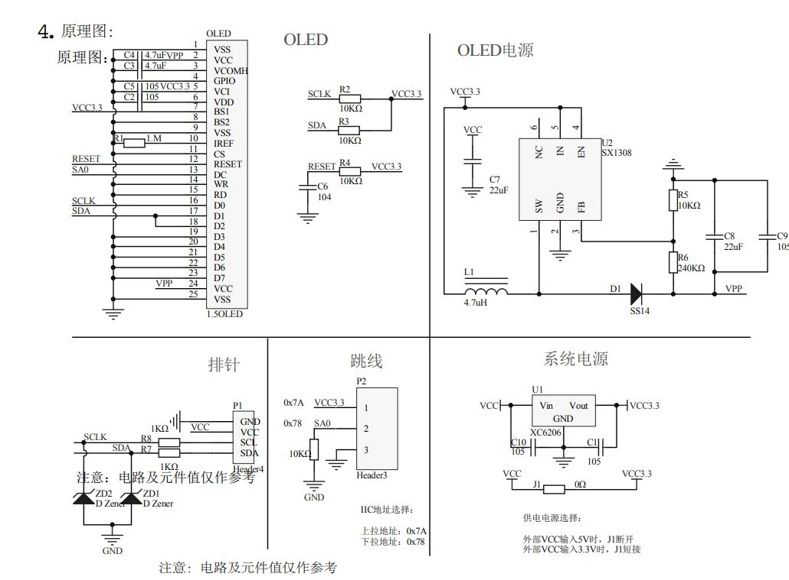

# MultiplexMC2020Retrofit
Multiplex MC2020 firmware replacement with Arduino Mega2560

Firmware/MCU replacement to retrofit a Multiplex MC2020 radiotransmitter.
The HF module is kept.

Use a SSD1327 OLED 128x128 OLED display in place of the liquid crystal display.

<div style="page-break-after: always"></div>

# Wiring pour NANO sur émetteur simple


<div style="page-break-after: always"></div>



<div style="page-break-after: always"></div>

*Prévoir une résistance de pull-up de 4.7kOhm à 5V sur SDA et SCL !*

| Pin   | Nom          |  Type de Signal  |    A relier sur      |
|:------|:-------------|:-----------------|:--------------------:|
| D13   | Led interne  | Di.Out 0/5V      |          -           |
| 3.3V  | 3.3V Régul.  | Sortie 3.3V      |      OLED VCC        |
| AREF  | Ref.interne  | 0..5V            |          -           |
| A0    | Profondeur   | An.In 0..5V      | Potar Prof           |
| A1    | Direction    | An.In 0..5V      | Potar Direc          |
| A2    | Gaz          | An.In 0..5V      | Potar Gaz            |
| A3    | Aileron      | An.In 0..5V      | Potar Aileron        |
| A4    | SDA (I2C)    | I2C Data 5V      | OLED SDA et pull-up 4.7kOhm |
| A5    | SCL (I2C)    | I2C Clock 5V     | OLED SCL et pull-up 4.7kOhm |
| A6    | Trim1        | An.In 0..5V      |          -           |
| A7    | Trim2        | An.In 0..5V      |          -           |
| +5V   | 5V Régul.    | Sortie 5V        | commun des pull-up 4.7kOhm   |
| RST   | Rest µC      | Entrée GND       |          -           |
| GND   | Masse        | GND              | commun GND           |
| VIN   | Alim régul.  | 7-12V            | (+) batteries        |


<div style="page-break-after: always"></div>


| Pin   | Nom          |  Type de Signal  |    A relier sur      |
|:------|:-------------|:-----------------|:--------------------:|
| D12   |              |                  |           -          |
| D11   |              |                  |           -          |
| D10   | PPM          | Pulses 0/5V      | Entrée module HF     |
| D9    |              |                  |           -          |
| D8    |              |                  |           -          |
| D7    | Btn Option 2 | Entrée bouton    | GND à ramener via bouton |
| D6    | Btn Option 1 | Entrée bouton    | GND à ramener via bouton |
| D5    | Btn Page     | Entrée bouton    | GND à ramener via bouton |
| D4    | Btn Next     | Entrée bouton    | GND à ramener via bouton |
| D3    | Btn Next     | Entrée bouton    | GND à ramener via bouton |
| D2    | Btn Next     | Entrée bouton    | GND à ramener via bouton |
| GND   | Masse        | GND              | commun GND           |
| RST   | Rest µC      | Entrée GND       |           -          |
| RX0   |              |                  |           -          |
| TX1   |              |                  |           -          |


<div style="page-break-after: always"></div>


```
[SDA NANO] -----o----- [SDA OLED]
                |
                o
           [4.7 kOhm]
                o
                |
                o
              [+5V]
                o
                |
                o
            [4.7 kOhm]
                o
                |
[SCL NANO] -----o----- [SCL OLED]

```

